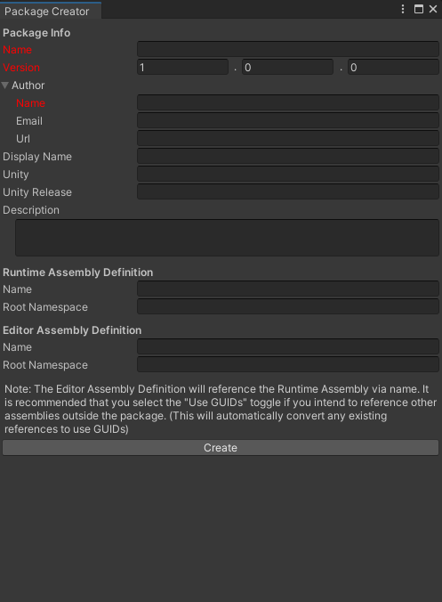

# UPM Package Creation Tool
A simple utility for generating new packages for use with Unity's [Package Manager](https://docs.unity3d.com/Manual/Packages.html).

Automatically generates the following in a new [embedded package](https://docs.unity3d.com/Manual/CustomPackages.html#:~:text=Creating%20a%20new%20embedded%20package):
* Folders:
  * Documentation~
  * Editor
  * Runtime
  * Samples~
* Files:
  * Documentation~/&lt;package-name>.md
  * Editor/&lt;input-editor-assembly>.asmdef, *pre-filled with input default namespace (optional)*
  * Runtime/&lt;input-runtime-assembly>.asmdef, *pre-filled with input default namespace (optional)*
  * CHANGELOG.md
  * README.md, *pre-filled with "# &lt;package-display-name>"*
  * package.json, *pre-filled with input details*
  
**We don't recommend that you use this tool in production projects.** The practise that we follow is to create an empty project and use git to install any packages in development directly into the Packages folder.

## Requirements
Unity 2020.3 or newer.

## Installation
The package can be installed by following [Unity's instructions for installing via git url](https://docs.unity3d.com/Manual/upm-ui-giturl.html).

You can use the following url to install the current version on the main branch: https://github.com/DreemAR/com.dreemar.package-creator

Alternatively, you can use https://github.com/DreemAR/com.dreemar.package-creator#v1.0.0 to get the latest version. You can also target any previous releases that are available by replacing the version code at the end of the provided url.

## How to use
Open the wizard via Tools->Create Package.

Fields marked in red are required and must be filled. The other fields are recommended, but not required.

Click "Create" at the bottom to generate the package. The tool will request the Package Manager to resolve packages and your new package should then be visible.

